# English to Dotfile

Take English requirements of any size and produce a valid `.dot` pipeline file that Kilroy's Attractor engine can execute to build the described software.

## When to Use

- User provides requirements and wants Kilroy to build them
- Input ranges from "solitaire plz" to a path to a 600-line spec
- You need to produce a `.dot` file, not code

## Process

### Phase 1: Requirements Expansion

If the input is short/vague, expand into a structured spec covering: what the software is, language/platform, inputs/outputs, core features, acceptance criteria. Write the expanded spec to `.ai/spec.md`.

If the input is already a detailed spec (or a file path to one), write a summary to `.ai/spec_summary.md` but do not rewrite the spec. Note the spec path — all prompts will reference it.

**The spec file is the source of truth.** Prompts reference it by path. Never inline hundreds of lines of spec into a prompt attribute.

### Phase 2: Decompose into Implementation Units

Break the spec into units. Each unit must be:

- **Achievable in one agent session** (~25 agent turns, ~20 min)
- **Testable** with a concrete command (go test, go build, etc.)
- **Clearly bounded** by files created/modified

Sizing heuristics:
- Core types/interfaces = early unit (everything depends on them)
- One Go package = one unit (not one file, not one function)
- Each major algorithm/subsystem = its own unit
- CLI/glue code = late unit
- Test harness = after the code it tests
- Integration test = final unit

For each unit, record: ID (becomes node ID), description, dependencies (other unit IDs), acceptance criteria (commands + expected results), complexity (simple/moderate/hard).

### Phase 3: Build the Graph

#### Required structure

```
digraph project_name {
    graph [
        goal="One-sentence summary of what the software does",
        rankdir=LR,
        default_max_retry=3,
        retry_target="<first implementation node>",
        model_stylesheet="
            * { llm_model: claude-sonnet-4-5; llm_provider: anthropic; }
            .hard { llm_model: claude-opus-4-6; llm_provider: anthropic; }
            .verify { llm_model: claude-sonnet-4-5; llm_provider: anthropic; reasoning_effort: medium; }
            .review { llm_model: claude-opus-4-6; llm_provider: anthropic; reasoning_effort: high; }
        "
    ]

    start [shape=Mdiamond, label="Start"]
    exit  [shape=Msquare, label="Exit"]

    // ... implementation, verification, and routing nodes ...
}
```

#### Node pattern: implement then verify

For every implementation unit, generate a PAIR of nodes plus a conditional:

```
impl_X [
    shape=box,
    class="hard",
    timeout=1200,
    max_retries=2,
    prompt="..."
]

verify_X [
    shape=box,
    class="verify",
    timeout=300,
    prompt="Verify [UNIT]. Run: go build ./... && go test ./pkg/X/... \nWrite status.json: outcome=success if all pass, outcome=fail with failure details otherwise."
]

check_X [shape=diamond, label="X OK?"]

impl_X -> verify_X
verify_X -> check_X
check_X -> impl_Y  [condition="outcome=success"]
check_X -> impl_X  [condition="outcome=fail", label="retry"]
```

#### Goal gates

Place `goal_gate=true` on:
- The final integration test node
- Any node producing a critical artifact (e.g., valid font file, working binary)

#### Review node

Near the end, after all implementation, add a review node with `class="review"` and `goal_gate=true` that reads the spec and validates the full project against it.

### Phase 4: Write Prompts

Every prompt must be **self-contained**. The agent executing it has no memory of prior nodes. Every prompt MUST include:

1. **What to do**: "Implement the bitmap threshold conversion per section 1.4 of specs/dttf-v1.md"
2. **What to read**: "Read specs/dttf-v1.md section 1.4 and pkg/dttf/types.go"
3. **What to write**: "Create pkg/dttf/loader.go with the LoadGlyphs function"
4. **Acceptance criteria**: "Run `go build ./...` and `go test ./pkg/dttf/...` — both must pass"
5. **Outcome instructions**: "Write status.json: outcome=success if all pass, outcome=fail with failure_reason"

Implementation prompt template:
```
Implement [DESCRIPTION].

Spec: [SPEC_PATH], section [SECTION_REF].
Read: [DEPENDENCY_FILES] for types/interfaces you need.

Create/modify:
- [FILE_LIST]

Acceptance:
- `[COMMAND_1]` must pass
- `[COMMAND_2]` must pass

Write status.json: outcome=success if all criteria pass, outcome=fail with failure_reason otherwise.
```

Verification prompt template:
```
Verify [UNIT_DESCRIPTION] was implemented correctly.

Run:
1. `go build ./...`
2. `go vet ./...`
3. `go test [PACKAGE]`
4. [DOMAIN_SPECIFIC_CHECKS]

Write results to .ai/verify_[NODE_ID].md.
Write status.json: outcome=success if ALL pass, outcome=fail with details.
```

### Phase 5: Model Selection

Assign `class` attributes based on Phase 2 complexity:

| Complexity | Class | Model | Use for |
|------------|-------|-------|---------|
| Simple | (default) | Sonnet | Boilerplate, types, CLI wiring |
| Hard | `hard` | Opus | Algorithms, complex logic |
| Verify | `verify` | Sonnet medium | Verification nodes |
| Review | `review` | Opus high | Final review, integration |

## Kilroy DSL Quick Reference

### Shapes (handler types)

| Shape | Handler | Use |
|-------|---------|-----|
| `Mdiamond` | start | Entry point. Exactly one. |
| `Msquare` | exit | Exit point. Exactly one. |
| `box` | codergen | LLM task (default). |
| `diamond` | conditional | Routes on edge conditions. |
| `hexagon` | wait.human | Human approval gate. |

### Node attributes

`label`, `shape`, `prompt`, `max_retries`, `goal_gate`, `retry_target`, `class`, `timeout`, `llm_model`, `llm_provider`, `reasoning_effort`, `allow_partial`, `fidelity`, `thread_id`

### Edge attributes

`label`, `condition`, `weight`, `fidelity`, `thread_id`, `loop_restart`

### Conditions

```
condition="outcome=success"
condition="outcome=fail"
condition="outcome=success && context.tests_passed=true"
condition="outcome!=success"
```

Custom outcome values work: `outcome=port`, `outcome=skip`, `outcome=needs_fix`. Define them in prompts, route on them in edges.

### Canonical outcomes

`success`, `partial_success`, `retry`, `fail`, `skipped`

## Anti-Patterns

1. **No verification after implementation.** Every impl node MUST have a verify node after it. Never chain impl → impl → impl.
2. **Labels instead of conditions.** `[label="success"]` does NOT route. Use `[condition="outcome=success"]`.
3. **All failures → exit.** Failure edges must loop back to the implementation node for retry, not to exit.
4. **Multiple exit nodes.** Exactly one `shape=Msquare` node. Route failures through conditionals, not separate exits.
5. **Prompts without outcome instructions.** Every prompt must tell the agent what to write in status.json.
6. **Inlining the spec.** Reference the spec file by path. Don't copy it into prompt attributes.
7. **Missing graph attributes.** Always set `goal`, `model_stylesheet`, `default_max_retry`.
8. **Wrong shapes.** Start is `Mdiamond` not `circle`. Exit is `Msquare` not `doublecircle`.
9. **No timeout.** Every codergen node needs `timeout`. Implementation: 1200. Verification: 300. Review: 600.
10. **Build files after implementation.** Project setup (go.mod, directory structure) must be the FIRST implementation node.

## Example: Minimal Pipeline

```dot
digraph linkcheck {
    graph [
        goal="Build a Go CLI tool that checks URLs for broken links",
        rankdir=LR,
        default_max_retry=3,
        model_stylesheet="
            * { llm_model: claude-sonnet-4-5; llm_provider: anthropic; }
            .review { llm_model: claude-opus-4-6; llm_provider: anthropic; reasoning_effort: high; }
        "
    ]

    start [shape=Mdiamond, label="Start"]
    exit  [shape=Msquare, label="Exit"]

    expand_spec [
        shape=box, timeout=600,
        prompt="Read the requirements: Build a Go CLI tool called linkcheck that takes a URL, crawls it, checks all links for HTTP status, reports broken ones. Supports robots.txt, configurable depth, JSON and text output.\n\nExpand into a full spec. Write to .ai/spec.md covering: CLI interface, packages, data types, error handling, test plan.\n\nWrite status.json: outcome=success"
    ]

    impl_setup [
        shape=box, timeout=600,
        prompt="Read .ai/spec.md. Create Go project: go.mod, cmd/linkcheck/main.go stub, pkg/ directories.\n\nRun: go build ./...\n\nWrite status.json: outcome=success if builds, outcome=fail otherwise."
    ]

    impl_core [
        shape=box, timeout=1200, max_retries=2,
        prompt="Read .ai/spec.md. Implement: URL crawling, link extraction, HTTP checking, robots.txt parser, output formatters (text + JSON). Create tests.\n\nRun: go test ./...\n\nWrite status.json: outcome=success if tests pass, outcome=fail otherwise."
    ]

    verify_core [
        shape=box, timeout=300,
        prompt="Run: go build ./... && go vet ./... && go test ./...\n\nWrite status.json: outcome=success if all pass, outcome=fail with details."
    ]

    check_core [shape=diamond, label="Core OK?"]

    review [
        shape=box, class="review", timeout=600, goal_gate=true,
        prompt="Read .ai/spec.md. Review the full implementation against the spec. Check: all features implemented, tests pass, CLI works, error handling correct.\n\nRun: go build ./cmd/linkcheck && go test ./...\n\nWrite status.json: outcome=success if complete, outcome=fail with what's missing."
    ]

    check_review [shape=diamond, label="Review OK?"]

    start -> expand_spec -> impl_setup -> impl_core -> verify_core -> check_core
    check_core -> review        [condition="outcome=success"]
    check_core -> impl_core     [condition="outcome=fail", label="retry"]
    review -> check_review
    check_review -> exit        [condition="outcome=success"]
    check_review -> impl_core   [condition="outcome=fail", label="fix"]
}
```


